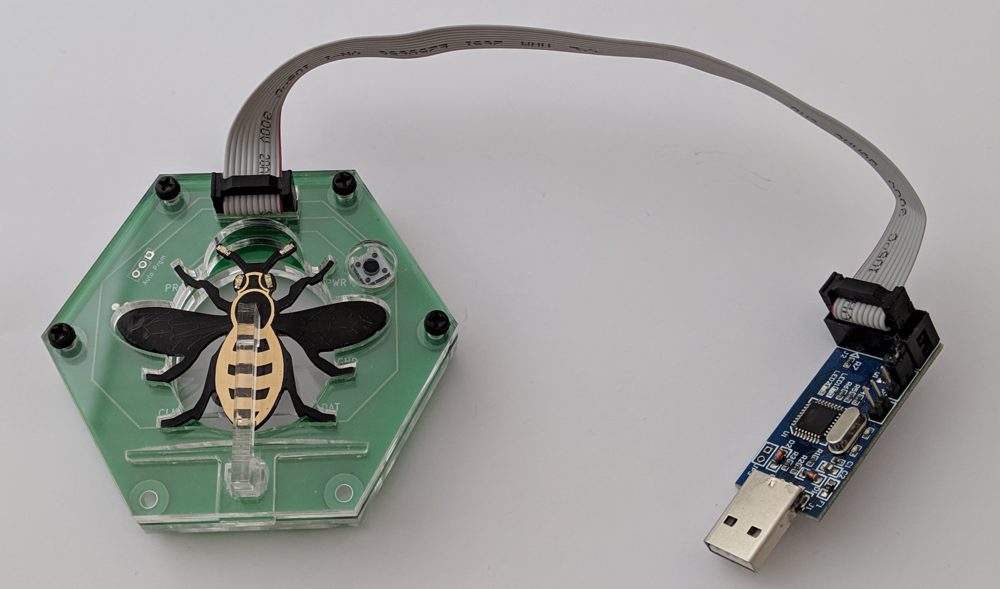
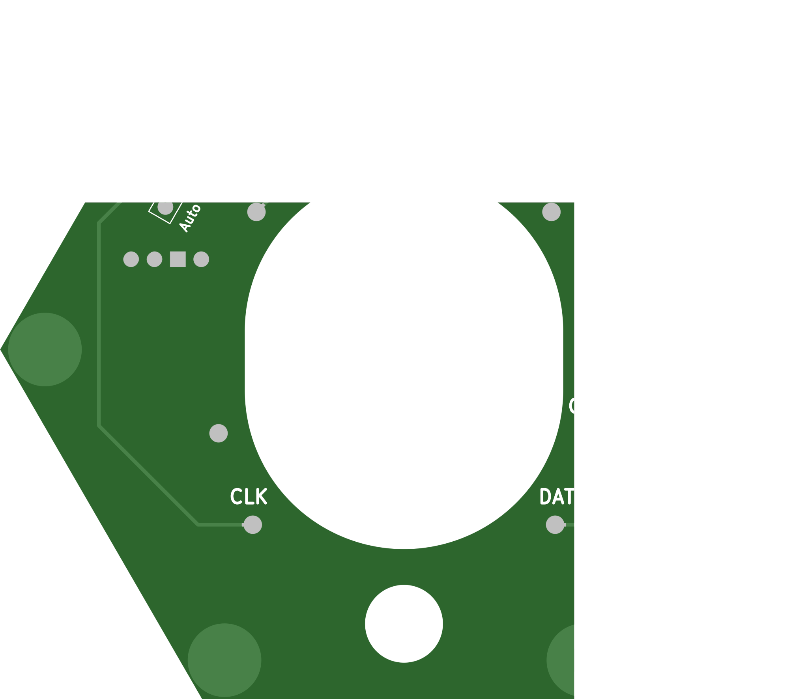
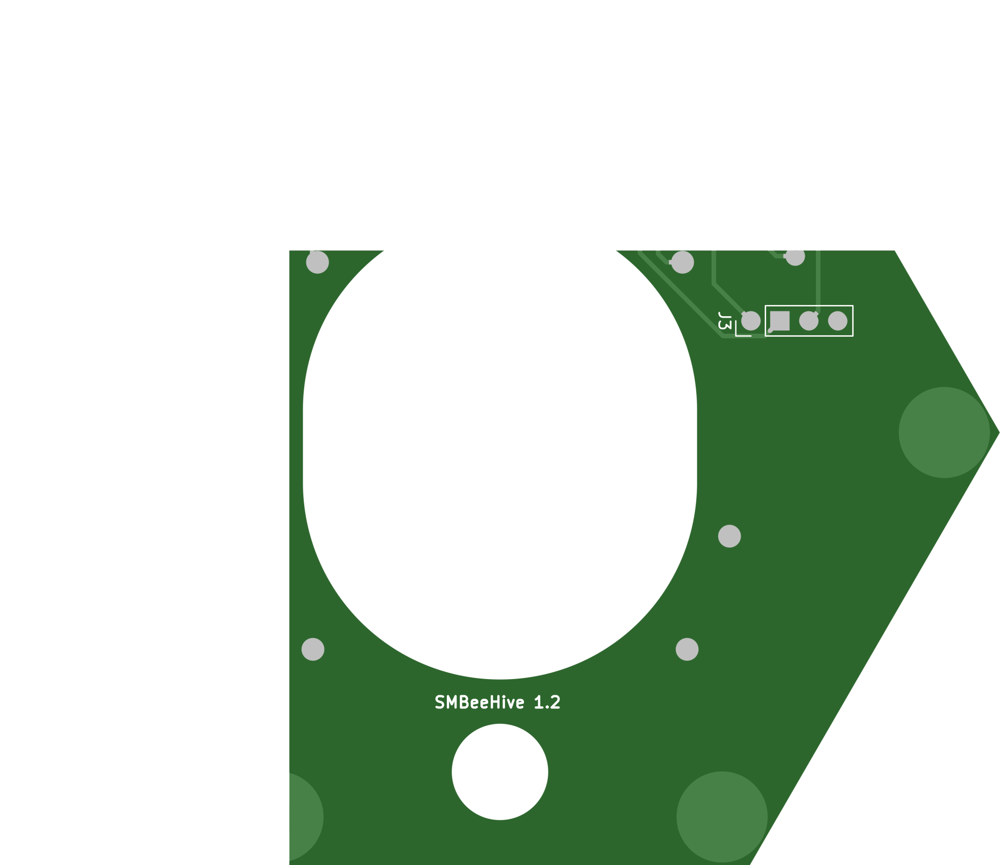
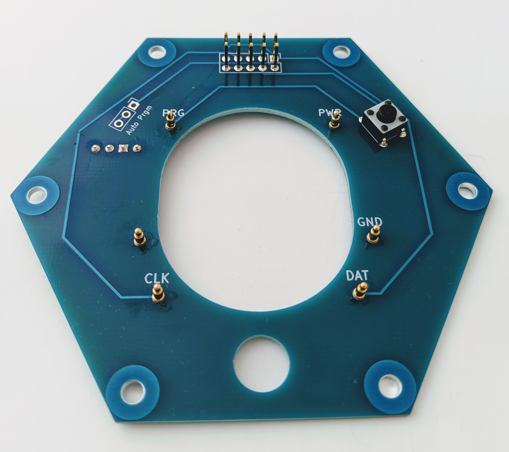
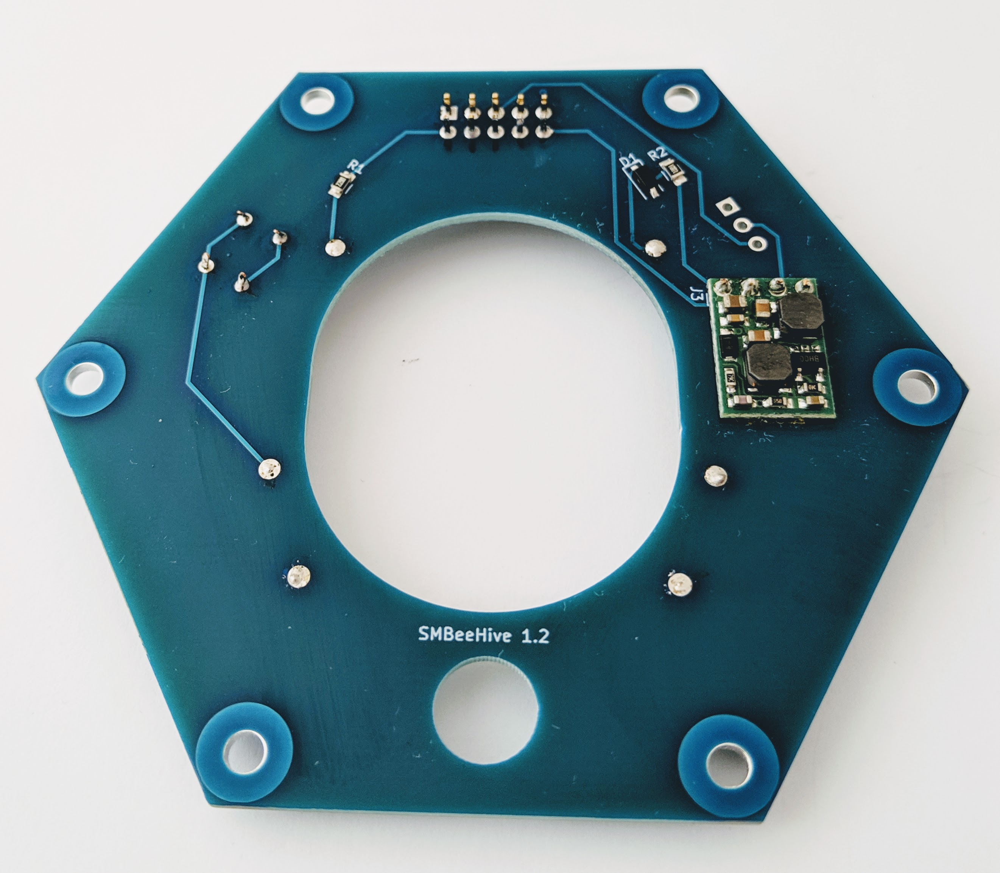
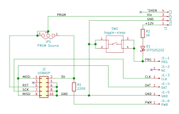

# SMBeeHiveKiCad

Anybody making an [SMBee] needs access to a programmer.

This is a low cost custom programmer you can use to give an SMBee a one-time programme or develope custom LED sequences for it. It uses the cheap widely available USBASP ISP programming module that you can purchase and re-flash with the required [custom firmware][SMBeeHive USBASP firmware].

There are two associated GitHub repositories:
* The case / jig design and laser cutter PDF: [SMBeeHive case]
* The custom USBASP firmware and reprogramming instructions: [SMBeeHive USBASP firmware].

---

**A fully assembled unit.** The USB programmer on the right is inexpensive, easily sourced and can be easily reprogrammed to support the project.

---

Top | Bottom
:-:|:-:
 | 
 | 

**The programmer PCB design images and a completed PCA.**

<!-- {:width="10px"} {:width="10px"}> -->

# Manufacturing Data

This is the information you need to have SMBeeHive PCBs manufactured.

## Gerber files

Generated gerber files for SMBeeHive version:

SMBeeHive | Generated with KiCad | Download 
-|-|-
1.2 (latest)| 5.0.2-5-10.14 | [SMBeeHive1.2.zip]

Typically just send the zip. The file formats and identifying file extensions will be accepted by most manufacturers including:

* [ELECROW]
* [PCBs.io]
* [AISLER]

See the [SMBeeHive PCB costs] spreadsheet for more information on manufacturers.

## Manufacturing options

Some manufacturers have additional options that need to be specified:

Parameter | Value |
-|-
Layers | 2 |
Thickness | 1.6mm |
Finish | HASL lead-free |
Copper weight | 1oz |
PCB colour | *your choice* |
Dimensions | 88 x 76mm |
Castellated holes | no |

# BOM (Build Of Materials)

This is the [SMBeeHive BOM] Spreadsheet. It lists all the required components and suggested and alternate supplies and prices dependant on order quantity.

# Assembly instructions

See the [Project documentation][SMBee].

# Schematic

Key features & operation:
1. The device functions as both a simple power-supply for the docked SMBee and flash memory programmer. For SMBee power-only operation, the USBASP module on J2 can be connected to a USB power supply or power bank.
1. SW1 mirrors the functionality of the SMBee toggle-sleep switch which isn't accessible when docked.
1. The docked SMBee connects to J1.
1. R1 limits the SMBee LED current for operation from a 3V or 5V supply voltage. The voltage is selectable with the USBASP J1 link and only affects LED brightness while docked.
1. The S10V2F12 DC-DC convertor on J3 generates the 12V Vpp programming voltage during SMBee programming. It is controlled by the USBASP custom firmware.
1. PRG is active at 12V only during programming, then removed, SMbee execute its new firmware when PRG is removed.
1. D1 is a Schottkey diode for low forward volt-drop. The diode prevents the DC-DC converter output from sinking current when it is disabled.
1. R2 limits the DC-DC current for protection if SW1 is pressed during programming.
1. JP1 is for manual programming voltage control. It is isn't used with the custom USBASP firmware and relies on the default link track; the USBASP reset signal has been repurposed to supply the DC-DC converter providing the 12V programming voltage to PRG.
1. The SMBee battery should be removed when connected to prevent charging of its primary cell. The case provides a mechanical lockout to prevent docking with the battery inserted.

# View or edit the PCB design

The PCB was designed using KiCad EDA software. If you would like to view or edit the design files, download it from [KiCad download] and install the software. 

Clone this repository into your local file space and open SMBeeHive.pro.

# SMBeeHive case

The case also performs as a jig to position the SMBee against the contact pins. It can be laser cut from 3mm acrylic sheet. You can find the details here:  [SMBeeHive case].

[SMBee]: https://github.com/milelo/SMBee
[SMBeeHive USBASP firmware]: https://github.com/milelo/SMBeeHiveFirmware
[HIVE-BOM]: https://docs.google.com/spreadsheets/d/1pC-4M-7qa12mT0QL2S9FdDb4QyRmq4kYofQHElQal1s/edit#gid=64958878
[SMBeeHive PCB costs]: https://docs.google.com/spreadsheets/d/1pC-4M-7qa12mT0QL2S9FdDb4QyRmq4kYofQHElQal1s/edit#gid=258570514
[ELECROW]: https://www.elecrow.com/pcb-manufacturing.html
[PCBs.io]: https://www.pcbs.io/
[AISLER]: https://aisler.net/
[SMBeeHive BOM]: https://docs.google.com/spreadsheets/d/1pC-4M-7qa12mT0QL2S9FdDb4QyRmq4kYofQHElQal1s/edit#gid=64958878
[KiCad download]: http://kicad-pcb.org/download/.
[SMBeeHive case]: https://github.com/milelo/SMBeeHiveF360
[SMBeeHive1.2.zip]: https://github.com/milelo/SMBeeHiveKiCad/blob/master/gerber/SMBeeHive1.2.zip?raw=true

---

This work is Copyright © 2019 Mike Longworth

 This work is licensed under a <a rel="license" href="http://creativecommons.org/licenses/by/4.0/">Creative Commons Attribution 4.0 International License</a>.